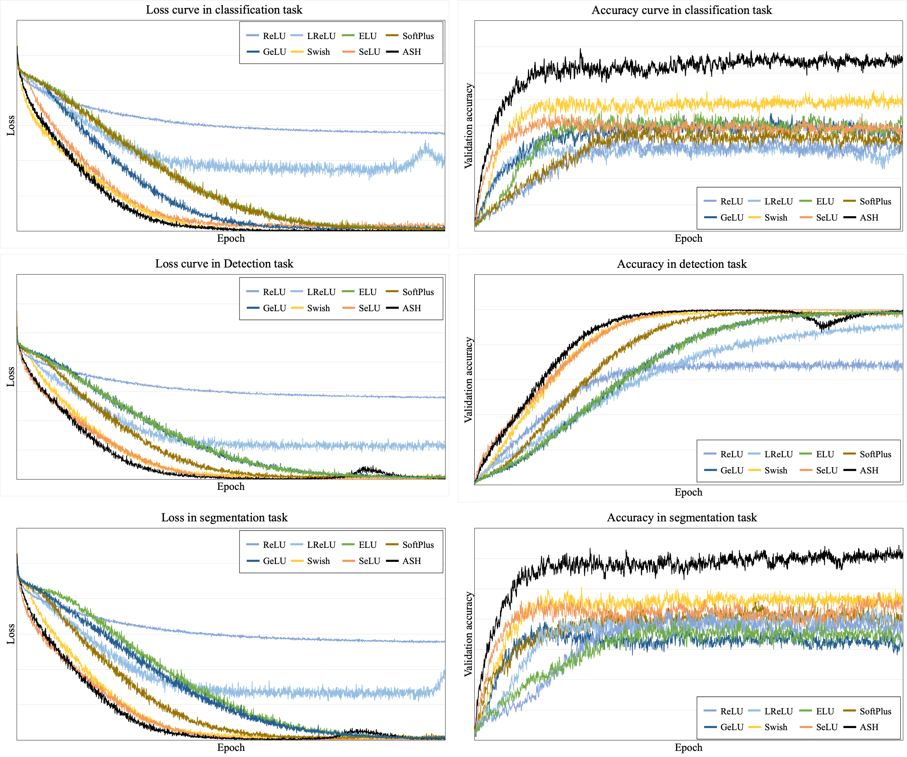

## Preparations
### 1. Download Codes
    $ git clone https://github.com/kyungsu-lee-ksl/ASH
    $ cd ASH-main


### 2. Primary Environment

#### A. Tensorflow 1

ASH activation function has been developed using TensorFlow 1, but most of the functions of Tensorflow have been deprecated. The dependency would be under _TensorFlow-GPU_ _1.14_ version.

* Python dependency 

```
$ python -m pip install tensorflow-gpu==1.14
$ python -m pip install opencv-python
```

* GPU Acceleration
  * Cuda ([CUDA Toolkit Archive](https://developer.nvidia.com/cuda-toolkit-archive))
  * cuDNN ([NVIDIA Developer](https://developer.nvidia.com/))


Check Installation

    import tensorflow

    print(tensorflow.__version__)
    print(tensorflow.Session())


<br />

#### B. Tensorflow 2

ASH activation function was primarily implemented using Conda and TensorFlow 2 in the environment of Apple Silicon Chip. The dependency would be under _tensorflow-metal_ and _tensorflow-macos_.

    # xcode dependency
    $ xcode-select --install

    # opencv-python dependency
    $ conda install -c conda-forge opencv

    # Conda & Tensorflow dependency
    $ conda install -c apple tensorflow-deps==2.8.0

    # Additional Conda Library
    $ conda install pydot
    $ conda install graphviz

    # Tensorflow Dependency
    $ python -m pip install tensorflow-macos==2.8.0
    $ python -m pip install tensorflow-metal==0.4.0


Check Installation

    import tensorflow

    print(tensorflow.__version__)
    print(tensorflow.test.is_built_with_cuda())

<br />


#### C. PyTorch

Conda install

    $ conda install pytorch torchvision torchaudio cpuonly -c pytorch
    $ conda install pytorch torchvision torchaudio cudatoolkit=11.3 -c pytorch

PIP install

    python -m pip install pytorch torchvision torchaudio cpuonly


* GPU Acceleration [(HomePage)](https://pytorch.org/)
  * Cuda ([CUDA Toolkit Archive](https://developer.nvidia.com/cuda-toolkit-archive))
  * cuDNN ([NVIDIA Developer](https://developer.nvidia.com/))


Check Installation

    import torch

    print(torch.__version__)
    print(torch.cuda.is_available())


<br>


## Usage Example
### 1. Tensorflow 1

    imgHolder = tf.placeHolder(dtype=tf.float32, shape=(None, 256, 256, 3))

    model1 = VGG11(imgHolder, activation=ASH, activation2=tf.nn.relu, num_classes=1000, name='vgg11')
    model2 = VGG19(imgHolder, activation=ASH, activation2=tf.nn.relu, num_classes=1000, name='vgg19')


### 2. Tensorflow 2


    model_builder = keras.applications.xception.Xception
    img_size = (299, 299)

    # Make model
    model1 = model_builder(weights="imagenet")
    model1.layers[-1].activation = None
    model1 = insert_layer_nonseq(model1, '.*act', ASH)

    model2 = model_builder(weights="imagenet")
    model2.layers[-1].activation = None
    model2 = insert_layer_nonseq(model2, 'block13_sepconv2_act', Swish)

    model1.summary()
    model2.summary()


### 3. PyTorch

<br>


# Datasets

## 1. Classification Task

### A. CIFAR-10 & CIFAR-100 Datasets

<p align="center">
  
</p>

* Abstract

  The tiny images dataset on which we based all of our experiments was collected by colleagues at MIT
and NYU over the span of six months; it is described in detail in [14]. They assembled it by searching the
web for images of every non-abstract English noun in the lexical database WordNet[15, 8]. They used
several search engines, including Google, Flickr, and Altavista and kept roughly the First 3000 results
for each search term. After collecting all the images for a particular search term, they removed perfect
duplicates and images in which an excessively large portion of the pixels were white, as they tended to
be synthetic Figures rather than natural images. The search term used to Find an image provides it with
a rough label, although it is extremely unreliable due to the nature of online image search technology.
In total, the dataset contains 80 million colour images downscaled to 32 × 32 and spread out across
79000 search terms. Most of our experiments with unsupervised learning were performed on a subset of
about 2 million images.


* Dataset Description

  * <b>CIFAR-10</b>: The CIFAR-10 dataset consists of 60000 32x32 colour images in 10 classes, with 6000 images per class. There are 50000 training images and 10000 test images.

  * <b>CIFAR-100</b>: This dataset is just like the CIFAR-10, except it has 100 classes containing 600 images each. There are 500 training images and 100 testing images per class. The 100 classes in the CIFAR-100 are grouped into 20 superclasses. Each image comes with a "fine" label (the class to which it belongs) and a "coarse" label (the superclass to which it belongs).

  * <b>Images</b>: $N \times (32 \times 32 \times 3)$ numpy array of uint8s. Each row of the array stores a $32 \times 32$ colour image. The first 1024 entries contain the red channel values, the next 1024 the green, and the final 1024 the blue. The image is stored in row-major order, so that the first 32 entries of the array are the red channel values of the first row of the image.

  * <b>Labels</b>: a list of 10000 numbers in the range 0-9 or 0-99. The number at index $i$ indicates the label of the ith image in the array data.


* Dataset Download

  * [CIFAR-10](https://www.cs.toronto.edu/~kriz/cifar-10-python.tar.gz)
  
  * [CIFAR-100](https://www.cs.toronto.edu/~kriz/cifar-100-python.tar.gz)

  * [Keras](https://github.com/keras-team/keras/blob/v2.10.0/keras/datasets/cifar10.py#L29)

  * [Tensorflow Support] [[CIFAR-10]](https://www.tensorflow.org/datasets/catalog/cifar10), [[CIFAR-100]](https://www.tensorflow.org/datasets/catalog/cifar100)
  
* Code

  The archive contains the files data_batch_1, data_batch_2, ..., data_batch_5, as well as test_batch. Each of these files is a Python "pickled" object produced with cPickle. 

> ```
> def unpickle(file):
>     import pickle
>     with open(file, 'rb') as fo:
>         dict = pickle.load(fo, encoding='bytes')
>     return dict
> ```

#### Related paper

  [[Paper]](http://citeseerx.ist.psu.edu/viewdoc/download?doi=10.1.1.222.9220&rep=rep1&type=pdf) [[Code]](https://www.cs.toronto.edu/~kriz/cifar.html) Krizhevsky, A., & Hinton, G. (2009). Learning multiple layers of features from tiny images.

> ```
> @article{krizhevsky2009learning,
>   title={Learning multiple layers of features from tiny images},
>   author={Krizhevsky, Alex and Hinton, Geoffrey and others},
>   year={2009},
>   publisher={Citeseer}
> }
> ```


<br />

##


### B. ImageNet

<p align="center">
  
</p>

* Abstract

The explosion of image data on the Internet has the potential to foster more sophisticated and robust models and algorithms to index, retrieve, organize and interact with images and multimedia data. But exactly how such data can be harnessed and organized remains a critical problem. We introduce here a new database called “ImageNet”, a large-scale ontology of images built upon the backbone of the WordNet structure. ImageNet aims to populate the majority of the 80,000 synsets of WordNet with an average of 500–1000 clean and full resolution images. This will result in tens of millions of annotated images organized by the semantic hierarchy of WordNet. This paper offers a detailed analysis of ImageNet in its current state: 12 subtrees with 5247 synsets and 3.2 million images in total. We show that ImageNet is much larger in scale and diversity and much more accurate than the current image datasets. Constructing such a large-scale database is a challenging task. We describe the data collection scheme with Amazon Mechanical Turk. Lastly, we illustrate the usefulness of ImageNet through three simple applications in object recognition, image classification and automatic object clustering. We hope that the scale, accuracy, diversity and hierarchical structure of ImageNet can offer unparalleled opportunities to researchers in the computer vision community and beyond.

* Dataset Description

  * <b>Images</b>: The goal of this competition is to estimate the content of photographs for the purpose of retrieval and automatic annotation using a subset of the large hand-labeled ImageNet dataset (10,000,000 labeled images depicting 10,000+ object categories) as training. 

  * <b>Labels</b>: The training data, the subset of ImageNet containing the 1000 categories and 1.2 million images.


* Dataset Download

  * [ImageNet](https://www.image-net.org/download.php)

  * [Keras ImageNet](https://github.com/mostafaelhoushi/keras-imagenet)

  * [Tensorflow Support](https://www.tensorflow.org/datasets/catalog/imagenet2012)

#### Related paper

[[Paper]](https://arxiv.org/pdf/1409.0575) [[Code]](https://paperswithcode.com/dataset/imagenet) Russakovsky, Olga, et al. "Imagenet large scale visual recognition challenge." International journal of computer vision 115.3 (2015): 211-252.

> ```
> @article{russakovsky2015imagenet,
>  title={Imagenet large scale visual recognition challenge},
>  author={Russakovsky, Olga and Deng, Jia and Su, Hao and Krause, Jonathan and Satheesh, Sanjeev and Ma, Sean and Huang, Zhiheng and Karpathy, Andrej and Khosla, Aditya and Bernstein, Michael and others},
>  journal={International journal of computer vision},
>  volume={115},
>  number={3},
>  pages={211--252},
>  year={2015},
>  publisher={Springer}
> }
> ```


## 2. Detection Task

### A. Microsoft COCO Dataset

<p align="center">
  
</p>

* Abstract

We present a new dataset with the goal of advancing the state-of-the-art in object recognition by placing the question of object recognition in the context of the broader question of scene understanding. This is achieved by gathering images of complex everyday scenes containing common objects in their natural context. Objects are labeled using per-instance segmentations to aid in precise object localization. Our dataset contains photos of 91 objects types that would be easily recognizable by a 4 year old. With a total of 2.5 million labeled instances in 328k images, the creation of our dataset drew upon extensive crowd worker involvement via novel user interfaces for category detection, instance spotting and instance segmentation. We present a detailed statistical analysis of the dataset in comparison to PASCAL, ImageNet, and SUN. Finally, we provide baseline performance analysis for bounding box and segmentation detection results using a Deformable Parts Model.

* Dataset Description

  * <b>COCO-2014 Object Detection</b>: The first version of MS COCO dataset was released in 2014. It contains 164K images split into training (83K), validation (41K) and test (41K) sets, bounding boxes and per-instance segmentation masks with 80 object categories.


* Dataset Download

  * [COCO API](https://cocodataset.org/#download)

  * [Tensorflow Support](https://www.tensorflow.org/datasets/catalog/coco) 

* Code

The COCO API assists in loading, parsing, and visualizing annotations in COCO. The API supports multiple annotation formats (please see the data format page). For additional details see: CocoApi.m, coco.py, and CocoApi.lua for Matlab, Python, and Lua code, respectively, and also the Python API demo.

> ```
>   all:
>       # install pycocotools locally
>	    python setup.py build_ext --inplace
>	    rm -rf build
>
>   install:
> 	    # install pycocotools to the Python site-packages
>	    python setup.py build_ext install
>	    rm -rf build
> ```

#### Related paper

[[Paper]](https://arxiv.org/pdf/1405.0312) [[Code]](https://github.com/cocodataset/cocoapi) Lin, Tsung-Yi, et al. "Microsoft coco: Common objects in context." European conference on computer vision. Springer, Cham, 2014.

> ```
> @inproceedings{lin2014microsoft,
>  title={Microsoft coco: Common objects in context},
>  author={Lin, Tsung-Yi and Maire, Michael and Belongie, Serge and Hays, James and Perona, Pietro and Ramanan, Deva and Doll{\'a}r, Piotr and Zitnick, C Lawrence},
>  booktitle={European conference on computer vision},
>  pages={740--755},
>  year={2014},
>  organization={Springer}
>}
> ```


<br />

##

### B. PASCAL VOC 

<p align="center">
  
</p>

* Abstract

The PASCAL Visual Object Classes (VOC) challenge is a benchmark in visual object category recognition and detection, providing the vision and machine learning communities with a standard dataset of images and annotation, and standard evaluation procedures. Organised annually from 2005 to present, the challenge and its associated dataset has become accepted as the benchmark for object detection.
This paper describes the dataset and evaluation procedure. We review the state-of-the-art in evaluated methods for both classification and detection, analyse whether the methods are statistically different, what they are learning from the images (e.g. the object or its context), and what the methods find easy or confuse. The paper concludes with lessons learnt in the three year history of the challenge, and proposes directions for future improvement and extension.

* Dataset Description

  * <b>PASCAL Object Detection</b>: The data has been split into 50% for training/validation and 50% for testing. The distributions of images and objects by class are approximately equal across the training/validation and test sets. In total there are 21,738 images. Further [statistics](http://host.robots.ox.ac.uk/pascal/VOC/voc2010/dbstats.html) are online.

  * [Annotation Guideline](http://host.robots.ox.ac.uk/pascal/VOC/voc2010/guidelines.html)


* Dataset Download

  * [Pascal VOC](http://host.robots.ox.ac.uk/pascal/VOC/voc2010/index.html#devkit)

  * [Tensorflow Support](https://www.tensorflow.org/datasets/catalog/voc)


#### Related paper

[[Paper]](https://link.springer.com/article/10.1007/s11263-009-0275-4)  Everingham, Mark, et al. "The pascal visual object classes (voc) challenge." International journal of computer vision 88.2 (2010): 303-338.


> ```
> @article{everingham2010pascal,
>  title={The pascal visual object classes (voc) challenge},
>  author={Everingham, Mark and Van Gool, Luc and Williams, Christopher KI and Winn, John and Zisserman, Andrew},
>  journal={International journal of computer vision},
>  volume={88},
>  number={2},
>  pages={303--338},
>  year={2010},
>  publisher={Springer}
>}
> ```


<br>


## 3. Segmentation Task

### A. ADE20K Dataset

<p align="center">
  
</p>

* Abstract

We present a new dataset with the goal of advancing the state-of-the-art in object recognition by placing the question of object recognition in the context of the broader question of scene understanding. This is achieved by gathering images of complex everyday scenes containing common objects in their natural context. Objects are labeled using per-instance segmentations to aid in precise object localization. Our dataset contains photos of 91 objects types that would be easily recognizable by a 4 year old. With a total of 2.5 million labeled instances in 328k images, the creation of our dataset drew upon extensive crowd worker involvement via novel user interfaces for category detection, instance spotting and instance segmentation. We present a detailed statistical analysis of the dataset in comparison to PASCAL, ImageNet, and SUN. Finally, we provide baseline performance analysis for bounding box and segmentation detection results using a Deformable Parts Model.

* Dataset Description

  * The current version of the dataset contains:
    * 27,574 images (25,574 for training and 2,000 for testing) spanning 365 different scenes.
    * 707,868 unique objects from 3,688 categories, along with their WordNet definition and hierarchy.
    * 193,238 annotated object parts and parts of parts.
    * Polygon annotations with attributes, annotation time, depth ordering.


* Dataset Download 
  * To download the dataset, register in [this link](http://groups.csail.mit.edu/vision/datasets/ADE20K/request_data/). Once you are approved you will be able to download the data, following the [Terms of Use](http://groups.csail.mit.edu/vision/datasets/ADE20K/terms).

* Structure

  * Every image and its annotations are inside a `folder_name`, that you can find using `index_ade20k.pkl`. Once you are inside the folder name, for a given image `image_name` (e.g. `ADE_train_00016869`) you will find:

>> 1. `image_name.jpg`: containing the raw image, with blurred license plates and faces (e.g. [ADE_train_00016869.jpg](./dataset/ADE20K_2021_17_01/images/ADE/training/urban/street/ADE_train_00016869.jpg))
>> 2. `image_name_seg.png`: with the pixel-wise annotations of objects and instances (e.g. [ADE_train_00016869_seg.png](./dataset/ADE20K_2021_17_01/images/ADE/training/urban/street/ADE_train_00016869_seg.png)). The RGB channels encode the class and instance information. Check out (`utils/utils_ade20k.py`)[utils/utils_ade20k.py] for an example on how to read those.
>> 3. `image_name_parts_{i}.png`: with the annotation of the parts at level `i` (e.g. [ADE_train_00016869_parts_1.png](dataset/ADE20K_2021_17_01/images/ADE/training/urban/street/ADE_train_00016869_parts_1.png)).
>> 4. `image_name`: a folder with all the instances in that image, stored as pngs encoding a binary amodal mask (showing occluded objects) (e.g. [ADE_train_00016869](dataset/ADE20K_2021_17_01/images/ADE/training/urban/street/ADE_train_00016869)).
>> 5. `image_name.json`: a json file containing information about the time the object was annotated, the polygons annotated, annotation of attributes etc. (e.g [ADE_train_00016869.json](dataset/ADE20K_2021_17_01/images/ADE/training/urban/street/ADE_train_00016869.json)).

#### Related paper

[[Paper]](https://arxiv.org/pdf/1405.0312) [[Code]](https://github.com/CSAILVision/ADE20K) Scene Parsing through ADE20K Dataset. Bolei Zhou, Hang Zhao, Xavier Puig, Sanja Fidler, Adela Barriuso and Antonio Torralba. Computer Vision and Pattern Recognition (CVPR), 2017. 

> ```
> @inproceedings{zhou2017scene,
>  title={Scene parsing through ade20k dataset},
>  author={Zhou, Bolei and Zhao, Hang and Puig, Xavier and Fidler, Sanja and Barriuso, Adela and Torralba, Antonio},
>  booktitle={Proceedings of the IEEE conference on computer vision and pattern recognition},
>  pages={633--641},
>  year={2017}
>}
> ```


### B. PASCAL VOC (Segmentation)

<p align="center">
  
</p>

* Abstract

The PASCAL Visual Object Classes (VOC) 2012 dataset contains 20 object categories including vehicles, household, animals, and other: aeroplane, bicycle, boat, bus, car, motorbike, train, bottle, chair, dining table, potted plant, sofa, TV/monitor, bird, cat, cow, dog, horse, sheep, and person. Each image in this dataset has pixel-level segmentation annotations, bounding box annotations, and object class annotations. This dataset has been widely used as a benchmark for object detection, semantic segmentation, and classification tasks. The PASCAL VOC dataset is split into three subsets: 1,464 images for training, 1,449 images for validation and a private testing set.

* Dataset Description

  * <b>PASCAL Segmentation</b>: The data has been split into 50% for training/validation and 50% for testing. The distributions of images and objects by class are approximately equal across the training/validation and test sets. [Statistics](http://host.robots.ox.ac.uk/pascal/VOC/voc2012/dbstats.html) of the database are online.

  * [Segmentation examples](http://host.robots.ox.ac.uk/pascal/VOC/voc2012/segexamples/index.html)


* Dataset Download

  * [Pascal VOC](http://host.robots.ox.ac.uk/pascal/VOC/voc2012/VOCtrainval_11-May-2012.tar)


#### Related paper

[[Paper]](https://link.springer.com/article/10.1007/s11263-014-0733-5) Everingham, Mark, et al. "The pascal visual object classes challenge: A retrospective." International journal of computer vision 111.1 (2015): 98-136.


> ```
> @Article{Everingham15,
>   author = "Everingham, M. and Eslami, S. M. A. and Van~Gool, L. and Williams, C. K. I. and Winn, J. and Zisserman, A.",
>   title = "The Pascal Visual Object Classes Challenge: A Retrospective",
>   journal = "International Journal of Computer Vision",
>   volume = "111",
>   year = "2015",
>   number = "1",
>   month = jan,
>   pages = "98--136",
>}
> ```


<br />


# Adaptive SwisH (ASH): Stochastic Adaptive Activation Function

## 1. Problem Definition 

Let $X \in R^{H \times W \times C}$ be a tensor (i.e., feature-map) disregarding the batch, but with a height $H$, width $W$, and channel $C$, and let $\bar{X} \ni X$ be a set of feature-maps. Let $A$ be an activation function such that $A: \bar{X} \rightarrow \bar{X}$. We can then extract the $i^{th}$ element from $X$, and denote it as $x^{(i)}$. Here, the goal of this study is to design the activation function represented as follows:

$$
  A(x^{(i)}) =
  \begin{cases}
  x^{(i)} & \text{if}\ x^{(i)}\ \text{is ranked in the top-k percentile of X}, \\
  0 & \text{otherwise}
  \end{cases}
$$

## 2. Formulation

Let $X$ be an input of ASH activation function $A$ and be a tensor of which elements are normally distributed. Furthermore, let $x^{(i)} \in X$ be the $i$-th element in $X$. Then, by __Proposition 2__, ASH activation function, which samples the top-$k$\% elements from the input, is represented as follows:

$$
\label{eq:ash01}
  \textit{A}(x^{(i)}) =
  \begin{cases}
  x^{(i)} & \text{if}\ x^{(i)} \geq \mu_X + z_k\sigma_X, \\
  0 & \text{otherwise}
  \end{cases}
$$

where $\mu_X$ and $\sigma_X$ are the mean and the standard deviation of all elements in $X$, respectively, and $z_k$ is the Z-score concerning percentile $k$ to sample (i.e., $z=1.96$ if $k=2.5$\%, see Z-table). Equation exhibits that ASH activation function is represented in a simple yet effective form with low computational costs.

For simplicity, suppose that a Heaviside step function is defined as $H(x)=\frac{d}{dx}\text{max}(0, x)$, and thus $f(x^{(i)}) = H(x^{(i)} - \mu_X - z_k\sigma_X)$. Then, we obtain the arithmetical form to formulate ASH activation function as follows:

$$
  \textit{A}(x^{(i)}) = x^{(i)}H(x^{(i)} - \mu_X - z_k\sigma_X)
$$


Even with the arithmetic formula, ASH activation function in Equation is still independent of $z_k$, and thus the $z_k$ is still not trainable. However, it is well known that the Heaviside step function is analytically approximated as $2H(x)=1+1\tanh(\alpha x)$ with a large value of $\alpha$, and thus ASH activation function is approximated using the smooth Heaviside step function as follows:

$$
\label{eq:ash04}
\begin{aligned}
  \textit{A}(x^{(i)})  &= x^{(i)}H(x^{(i)} - \mu_X - z_k\sigma_X) \\
              &= \frac{1}{2}x^{(i)} + \frac{1}{2}x^{(i)}\tanh(\alpha (x^{(i)} - \mu_X - z_k\sigma_X)) \\
              &= \frac{x^{(i)}}{1 + e^{-2\alpha(x^{(i)} - \mu_X - z_k\sigma_X)}}
\end{aligned}
$$


## 3. Generalization

We found the innovation while representing Equation using the sigmoid function $S(x) = \frac{1}{1+e^{-x}}$ as follows:

$$
\label{eq:ash05}
\begin{aligned}
  \textit{A}(x^{(i)})  &= x^{(i)}S\big(-2\alpha(x^{(i)} - \mu_X - z_k\sigma_X)\big) \\
              &= x^{(i)}S(ax^{(i)}+b))
\end{aligned}
$$

The previous work (ramachandran2017searching) introduced the leverage of automatic search techniques to discover the best performance activation function. The experiments empirically discovered that the Swish activation function is the best performance activation function, defined as $xS(x)$. Intuitively, the definition of the Swish activation function is the same with Equation, and it represents more generalized formula. Therefore, an ASH (Adaptive SwisH) activation function provides the theoretical explanations for why Swish was the best performance activation function in the empirical evaluations. 


##


<br>
<br>

# [PAPER] Stochastic Adaptive Activation Function

## Authors
Kyungsu Lee, Jaeseung Yang, Haeyun Lee, and Jae Youn Hwang*

## Abstract
The simulation of human neurons and neurotransmission mechanisms has been realized in deep neural networks based on the theoretical implementations of activation functions. However, recent studies have reported that the threshold potential of neurons exhibits different values according to the locations and types of individual neurons, and that the activation functions have limitations in terms of representing this variability. Therefore, this study proposes a simple yet effective activation function that facilitates different thresholds and adaptive activations according to the positions of units and the contexts of inputs. Furthermore, the proposed activation function mathematically exhibits a more generalized form of Swish activation function, and thus we denoted it as Adaptive SwisH (ASH). ASH highlights informative features that exhibit large values in the top percentiles in an input, whereas it rectifies low values. Most importantly, ASH exhibits trainable, adaptive, and context-aware properties compared to other activation functions. Furthermore, ASH represents general formula of the previously studied activation function and provides a reasonable mathematical background for the superior performance. To validate the effectiveness and robustness of ASH, we implemented ASH into many deep learning models for various tasks, including classification, detection, segmentation, and image generation. Experimental analysis demonstrates that our activation function can provide the benefits of more accurate prediction and earlier convergence in many deep learning applications.


## Experimental Results

<p align="center">
    
</p>

__[Training Curves]__ Average training graph of ResNet-164,Wide ResNet28-10, and DenseNet-100-12 on ImageNet dataset using various activation functions along with ASH.


<p align="center">
    
</p>

__[Classification Task]__ Grad-CAM samples generated by Baseline models with ReLU, ASH, and Swish activation functions using Imagenet dataset. ResNet-164 (1 ~ 5 rows) and Dense-Net (6 ~ 10 rows) are used as baseline models.


<p align="center">
    
</p>

__[Segmentation Task]__ Samples segmented by EfficientNet[tan2019efficientnet] with ReLU, PReLU, ELU, SoftPlus, GELU, SeLU, Swish, and ASH activation functions using ADE20K dataset.


<p align="center">
    
</p>

__[Generation Task]__ Samples generated by DCGAN with ReLU, Swish, and ASH activation functions using celebA dataset.


<p align="center">
    
</p>


__[Ablation Study]__ Comparison of various versions of ASH activation function. ASH activation function indicates the proposed activation function, L-ASH indicates Leaky ASH, and F-ASH-_k_ is ASH activation function that _k_-precentile is fixed rather than trainable.


## Conclusion
In this paper, we proposed a novel activation function to rectify inputs using an adaptive threshold considering the entire contexts of inputs more like human neurons. To this end, we designed an activation function to extract elements in the top-$k$ percentile from the input feature-map. Since sorting algorithm-based selections or quick selection algorithm demands a heavy computational cost, we employed the stochastic technique utilizing normal distribution to realize stochastic percentile sampling. Based on the mathematical derivations, we implemented ASH activation function in simple yet effective formula (f(x) = x sigmoid(ax+b)) with low computational cost for sampling the top-_k_ percentile from the input. In addition, we implemented ASH activation function, realizing (1) the adaptive threshold by employing the Z-score-based trainable variables and (2) the perception of entire contexts in rectifying an input by utilizing the mean and standard deviation of the input. Meanwhile, ASH activation function represented the generalized form of the Swish activation function that was empirically searched in the previous study. Therefore, this study also exhibited a novel contribution of the mathematical proofs for the state-of-the-art performance of the Swish activation function. Experiments using various deep learning models on different tasks (classification, detection, and segmentation) demonstrated superior performance for ASH activation function, in terms of accuracy, localization, and training time.


## Citation
If you find our work useful in your research, please consider citing our paper:

```
@inproceedings{,
  title={},
  author={},
  booktitle={},
  pages={},
  year={2022},
  organization={}
}
```
